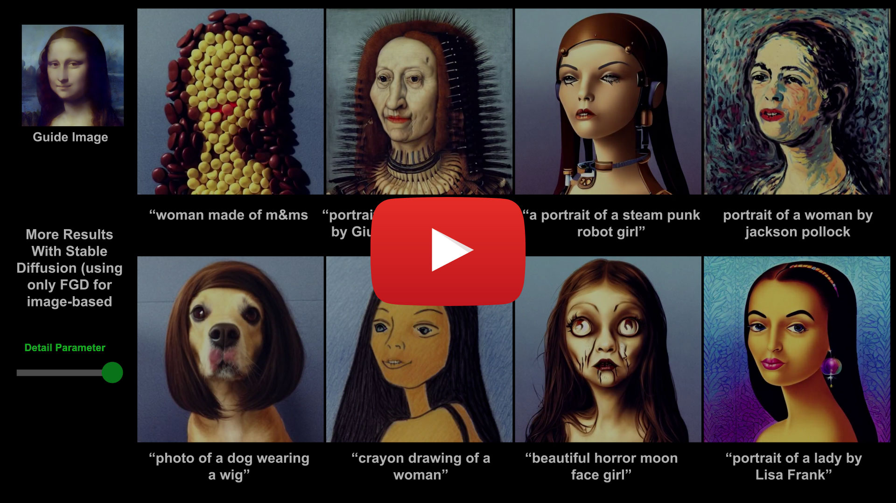
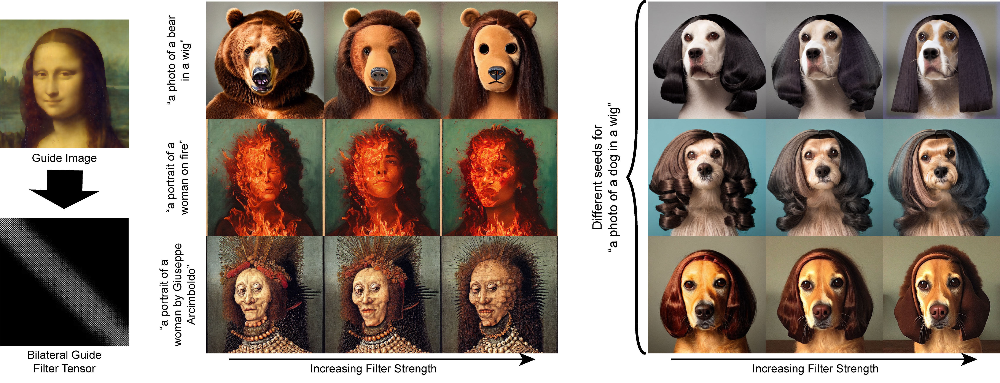

# Filtered-Guided Diffusion
*Fast, lightweight, architecture- and sampler-independent, low-level frequency control for diffusion-based Image-to-Image translations.*

[**Filtered-Guided Diffusion: Fast Filter Guidance for Black-Box Diffusion Models**](https://github.com/jaclyngu)<br/>
[Zeqi Gu](https://github.com/jaclyngu),
[Abe Davis](http://abedavis.com/)<br/>
_[GitHub](https://github.com/jaclyngu/FilteredGuidedDiffusion) | [arXiv](https://arxiv.org/abs/2306.17141)_


#### [Video:](https://youtu.be/JQXnEO1aI4I)
[](https://youtu.be/JQXnEO1aI4I)




## Requirements
Follow the instruction of [Stable Diffusion](https://github.com/CompVis/stable-diffusion/tree/main) to create a conda environment:

```
conda env create -f environment.yaml
conda activate ldm
```

After [obtaining the sd-v1-4-full-ema.ckpt](https://huggingface.co/CompVis/stable-diffusion-v-1-4-original), link them
```
mkdir -p StableDiffusion/models/ldm/stable-diffusion-v1/
ln -s <path/to/model.ckpt> StableDiffusion/models/ldm/stable-diffusion-v1/model.ckpt 